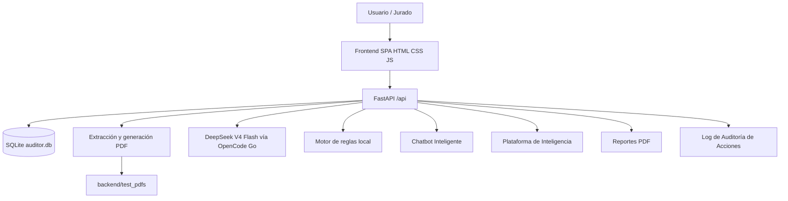
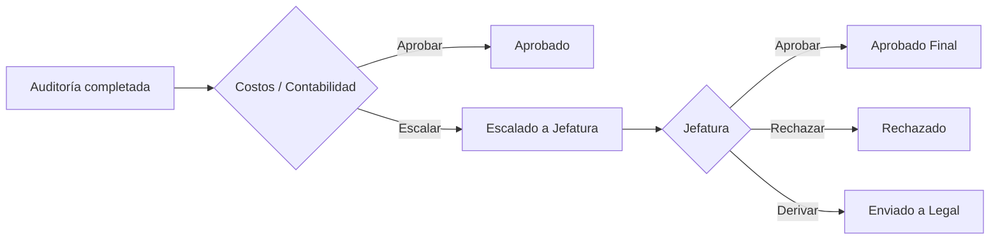

# Arquitectura — Miraclex

Miraclex corre como una aplicación FastAPI que sirve API REST, frontend estático y archivos PDF de demo.

## Diagrama

## Componentes

### Frontend

- Ubicación: `frontend/`.
- SPA sin compilación.
- Módulos JS por página.
- Consume API con base `/api`.

### Backend

- Ubicación: `backend/main.py`.
- Framework: FastAPI.
- Sirve frontend, endpoints REST, PDFs de prueba y reportes.
- 65+ endpoints REST documentados en Swagger (`/docs`).

### Base de Datos

- SQLite en `backend/auditor.db`.
- ORM con SQLAlchemy.
- Modelos principales: perfiles, asegurados, pólizas, vehículos, documentos, siniestros, declaraciones, partes policiales, facturas, ítems, auditorías, hallazgos y log de auditoría.

### Motor IA

- Archivo: `backend/deepseek_auditor.py`.
- Modelo: DeepSeek V4 Flash (`deepseek-v4-flash`).
- Gateway: OpenCode Go.
- Patrones: Chain-of-Thought, few-shot, self-reflection, validación semántica + retry.
- Soporte de auditoría individual, masiva y batch con concurrencia configurable.

### Motor de Reglas

- Archivo: `backend/rules_engine.py`.
- Uso: fallback o auditoría manual.

### Chatbot Inteligente

- Archivo: `backend/chatbot_agent.py`.
- Inferencia SQL + reescritura con DeepSeek V4 Flash.
- Restricciones por perfil/rol.
- Widget de burbuja flotante en el frontend.

### Plataforma de Inteligencia

- Endpoints en `backend/main.py`.
- Métricas antifraude, cartera, operaciones y cobertura.
- Insight por siniestro.
- Insight bajo demanda generado por DeepSeek V4 Flash.

### Generador Demo

- Facturas: `backend/test_invoice_generator.py`.
- Documentos demo: endpoints en `backend/main.py`.
- Salida: `backend/test_pdfs`.

### Scoring de Fraude

- Archivo: `backend/fraud_scoring.py`.
- 14 señales de fraude (S01–S14) + 7 reglas de negocio (RF01–RF07).
- Score normalizado 0–100 con semáforo Verde/Amarillo/Rojo.
- Ranking por score descendente.

### Sistema de Perfiles y Seguridad

- Archivos: `backend/auth.py`, `backend/profile_scope.py`.
- Autenticación HMAC-SHA256 por perfil.
- Aislamiento de datos con `ProfileScope`.
- Contraseñas con hash y salt.
- Perfil administrador con clave maestra.
- Log de auditoría de acciones (middleware automático).

## Flujo de Datos

1. El usuario genera o carga PDFs desde `Carga`.
2. FastAPI recibe el archivo.
3. El extractor obtiene datos del PDF.
4. El backend resuelve el siniestro por referencia `SIN-...` o crea uno mínimo cuando aplica.
5. La factura queda registrada y asociada al siniestro.
6. DeepSeek V4 Flash audita como motor principal.
7. Si DeepSeek falla, reglas locales pueden producir un resultado fallback.
8. La UI muestra hallazgos, score, motor usado y reportes.

## Flujo de Decisión Humana

## Arranque Portable

El launcher `scripts/start.py`:

- Crea `.venv` si no existe.
- Instala `backend/requirements.txt`.
- Verifica si `127.0.0.1:8000` ya responde.
- Levanta `uvicorn backend.main:app`.

Entradas:

- Windows: `start.bat`.
- macOS/Linux: `start.sh`.
- npm: `npm start`.

## Decisiones de Diseño

- SQLite para demo portable.
- Frontend sin build para reducir fallos de instalación.
- DeepSeek V4 Flash como motor principal para análisis explicable.
- Reglas como respaldo para resiliencia.
- Datos sintéticos para privacidad.
- Aislamiento por perfil con HMAC para seguridad de demo.
- Log de auditoría para trazabilidad administrativa.
- Flujo de decisión por roles para control humano.
