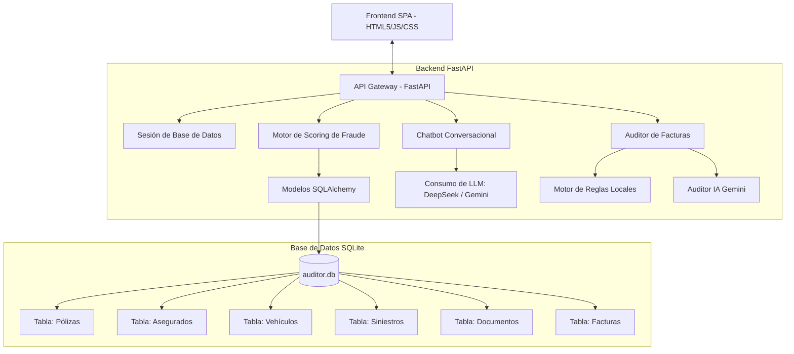

# 🏛️ Arquitectura del Sistema — Aseguradora del Sur

Este documento describe la arquitectura técnica del prototipo **Auditor Técnico y Detector de Riesgo Agéntico**.

## Diagrama de Arquitectura

## Descripción de Componentes

1. **Frontend (Capa de Presentación)**:
   - Una SPA (Single Page Application) responsiva construida con **HTML5 y Javascript Vanilla**.
   - Incluye micro-animaciones en las burbujas colapsables (Cola de Auditoría y Asistente de IA) para optimizar el espacio.

2. **API (FastAPI)**:
   - Capa intermedia asíncrona que expone las rutas REST para visualización, recálculo de scores, descarga de reportes y chatbot conversacional.

3. **Motor de Scoring de Fraude**:
   - Evalúa cada siniestro combinando **14 señales ponderadas** de fraude y **7 reglas de negocio críticas**.
   - Calcula el semáforo de riesgo (Verde, Amarillo, Rojo) y lo guarda en la base de datos de manera determinística.

4. **Agente Conversacional**:
   - Responde las preguntas de la Unidad Antifraude formuladas en lenguaje natural.
   - Funciona mediante un enfoque híbrido: extrae estadísticas agregadas y resúmenes específicos de la base de datos local y los envía a un LLM (**DeepSeek** o **Gemini 2.5 Flash** en fallback) para que redacte la respuesta final.

5. **Base de Datos (SQLite + SQLAlchemy)**:
   - Base de datos relacional compacta que persiste todo el modelo estructurado, sirviendo como fuente única de verdad para auditorías e informes.
