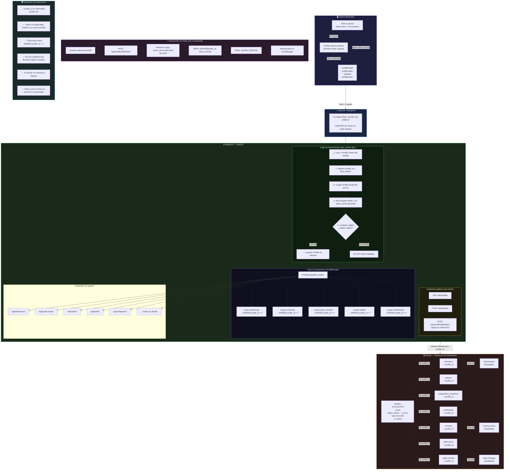

# Arquitectura de Seguridad — Sistema de Perfiles Aislados

## Diagrama de flujo de seguridad

## Descripción de las capas

### 1. Cliente — Gestión de sesión sin contraseña
- Al primer acceso (o tras cerrar sesión), aparece el **Profile Selector Modal**
- El usuario selecciona un perfil existente (por nombre) o crea uno nuevo
- El backend retorna un **token HMAC firmado** → se guarda en `localStorage`
- Cada request posterior inyecta `X-Profile-Token` via `api.js`

### 2. Capa de autenticación — `get_profile` (FastAPI dependency)
- Extrae el header `X-Profile-Token`
- Parsea `{profile_id}:{signature}`
- Carga el perfil de la BD por `profile_id`
- Recomputa `HMAC(profile_id, profile.token_secret)` y compara con `signature` usando `hmac.compare_digest` (tiempo constante, previene timing attacks)
- Si falla → `HTTP 403`, sin revelar si el ID existe o no

### 3. Capa de aislamiento — `ProfileScope`
- Wrapper de `Session` de SQLAlchemy
- **Toda query** pasa por `scope.entidad().filter(entidad.profile_id == self.profile_id)`
- Ningún endpoint de datos accede directamente a la sesión de BD sin pasar por `scope`
- Los getters individuales (`get_invoice(id)`) también filtran por `profile_id`: imposible acceder a registros de otro perfil incluso conociendo el ID

### 4. Base de datos — Integridad referencial
- `profile_id` como FK en 7 tablas primarias
- Tablas derivadas (`documentos`, `invoice_items`, `audit_findings`) heredan el aislamiento a través de sus padres
- Constraint `UNIQUE (profile_id, code)` en tarifas y `UNIQUE (profile_id, ruc)` en workshops
- Datos pre-existentes migrados al **perfil por defecto** (`00000000-0000-0000-0000-000000000001`)

### 5. Prevención de spoofing
| Vector de ataque | Mitigación |
|---|---|
| Manipular `profile_id` en la URL | `scope.get_X(id)` filtra por `profile_id` del token |
| Forjar un token para otro perfil | HMAC depende del `token_secret` almacenado en BD |
| Enumerar UUIDs de perfiles | UUIDs v4 = 2¹²² combinaciones, no adivinables |
| Timing attack en verificación | `hmac.compare_digest()` en tiempo constante |
| Inyección de header | FastAPI valida tipos estrictamente; header es string opaco |
