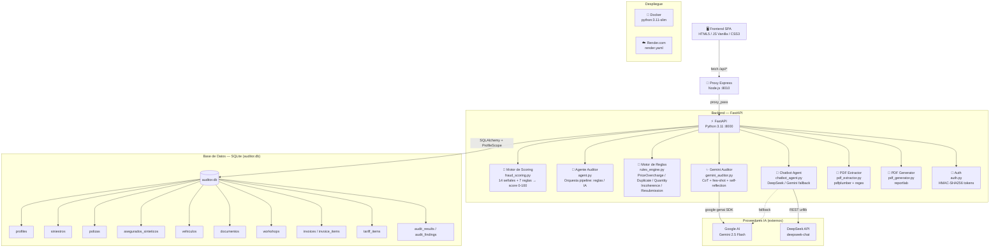
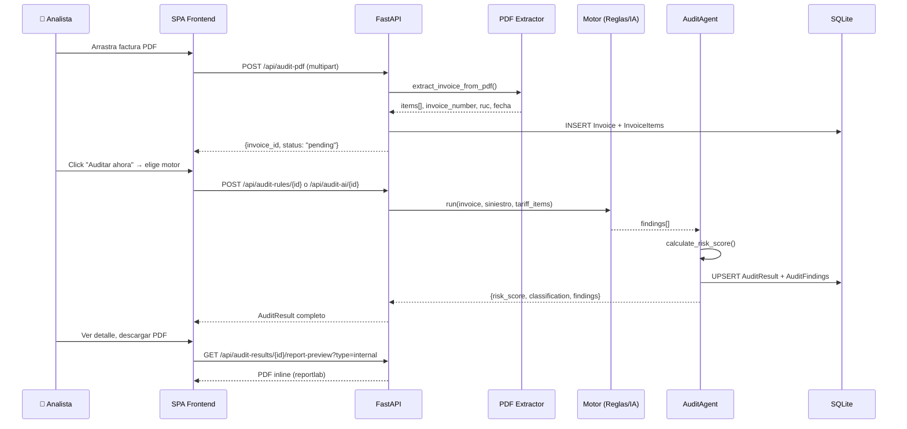

# Diagrama — Arquitectura del Sistema

> Fuente: [`docs/arquitectura.md`](../arquitectura.md)

## Arquitectura general (capas)

```mermaid
graph TD
    UI["🖥️ Frontend SPA\nHTML5 / JS Vanilla / CSS3"]
    PROXY["🔀 Proxy Express\nNode.js :8010"]
    API["⚡ FastAPI\nPython 3.11 :8000"]

    UI -->|"fetch /api/*"| PROXY
    PROXY -->|"proxy_pass"| API

    subgraph BackendFastAPI["Backend — FastAPI"]
        direction TB
        API --> FraudEngine["🎯 Motor de Scoring\nfraud_scoring.py\n14 señales + 7 reglas → score 0-100"]
        API --> AuditAgent["🤖 Agente Auditor\nagent.py\nOrquesta pipeline: reglas / IA"]
        API --> RulesEngine["📏 Motor de Reglas\nrules_engine.py\nPriceOvercharge / Duplicate / Quantity\nIncoherence / Resubmission"]
        API --> GeminiAuditor["✨ Gemini Auditor\ngemini_auditor.py\nCoT + few-shot + self-reflection"]
        API --> Chatbot["💬 Chatbot Agent\nchatbot_agent.py\nDeepSeek / Gemini fallback"]
        API --> PDFExtractor["📄 PDF Extractor\npdf_extractor.py\npdfplumber + regex"]
        API --> PDFGen["📑 PDF Generator\npdf_generator.py\nreportlab"]
        API --> Auth["🔐 Auth\nauth.py\nHMAC-SHA256 tokens"]
    end

    subgraph BaseDatos["Base de Datos — SQLite (auditor.db)"]
        direction LR
        DB[(auditor.db)]
        DB --> T1["profiles"]
        DB --> T2["siniestros"]
        DB --> T3["polizas"]
        DB --> T4["asegurados_sinteticos"]
        DB --> T5["vehiculos"]
        DB --> T6["documentos"]
        DB --> T7["workshops"]
        DB --> T8["invoices / invoice_items"]
        DB --> T9["tariff_items"]
        DB --> T10["audit_results / audit_findings"]
    end

    subgraph IAProv["Proveedores IA (externos)"]
        G["Google AI\nGemini 2.5 Flash"]
        D["DeepSeek API\ndeepseek-chat"]
    end

    API -->|"SQLAlchemy + ProfileScope"| DB
    GeminiAuditor -->|"google-genai SDK"| G
    Chatbot -->|"REST urllib"| D
    Chatbot -.->|"fallback"| G

    subgraph Despliegue["Despliegue"]
        DOCKER["🐳 Docker\npython:3.11-slim"]
        RENDER["☁️ Render.com\nrender.yaml"]
    end
```

## Flujo de auditoría (sequence)

```mermaid
sequenceDiagram
    participant Analista as 👤 Analista
    participant SPA as SPA Frontend
    participant API as FastAPI
    participant Extractor as PDF Extractor
    participant Motor as Motor (Reglas/IA)
    participant Agent as AuditAgent
    participant DB as SQLite

    Analista->>SPA: Arrastra factura PDF
    SPA->>API: POST /api/audit-pdf (multipart)
    API->>Extractor: extract_invoice_from_pdf()
    Extractor-->>API: items[], invoice_number, ruc, fecha
    API->>DB: INSERT Invoice + InvoiceItems
    API-->>SPA: {invoice_id, status: "pending"}

    Analista->>SPA: Click "Auditar ahora" → elige motor
    SPA->>API: POST /api/audit-rules/{id} o /api/audit-ai/{id}
    API->>Motor: run(invoice, siniestro, tariff_items)
    Motor-->>Agent: findings[]
    Agent->>Agent: calculate_risk_score()
    Agent->>DB: UPSERT AuditResult + AuditFindings
    Agent-->>API: {risk_score, classification, findings}
    API-->>SPA: AuditResult completo

    Analista->>SPA: Ver detalle, descargar PDF
    SPA->>API: GET /api/audit-results/{id}/report-preview?type=internal
    API-->>SPA: PDF inline (reportlab)
```
