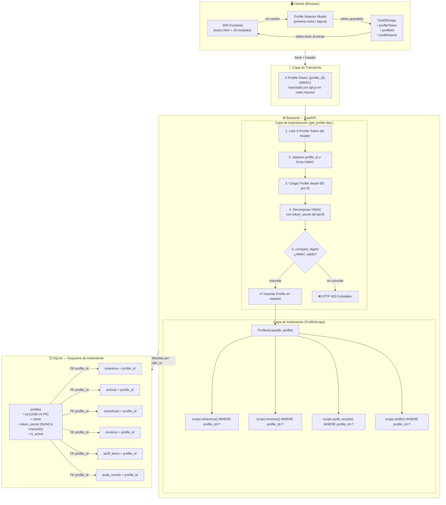
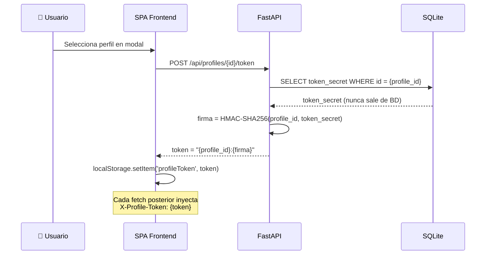
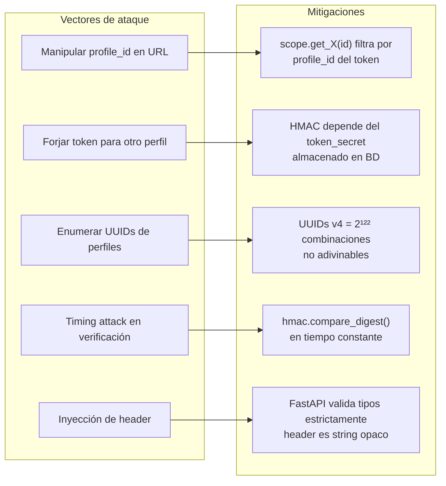

# Diagrama — Arquitectura de Seguridad

> Fuente: [`docs/arquitectura_seguridad.md`](../arquitectura_seguridad.md)

## Diagrama completo de seguridad

## Generación de token (sin contraseña)

## Prevención de vectores de ataque

