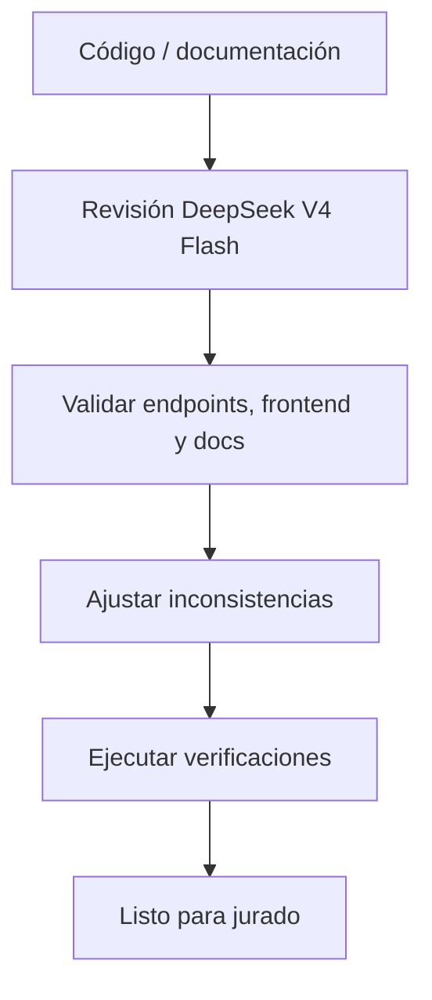
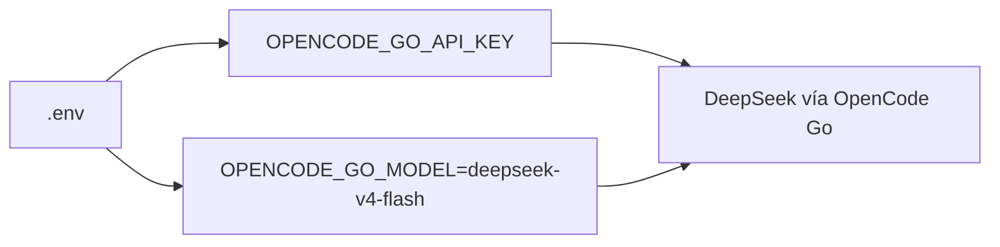
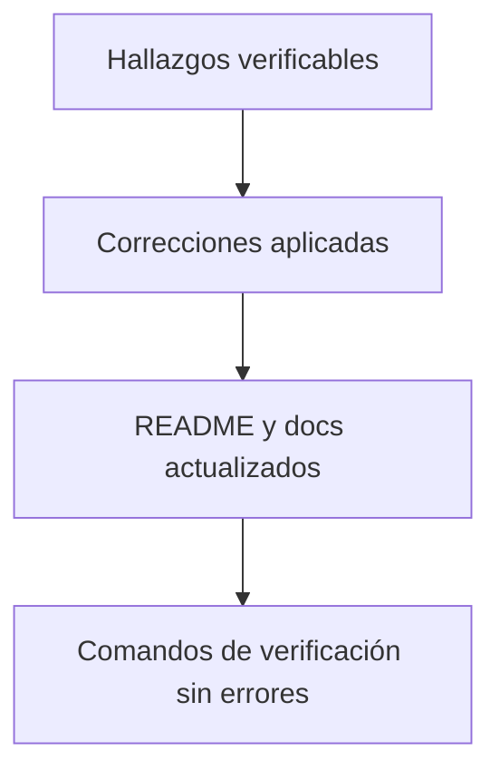

# Diagrama — DeepSeek Review Loop

> Fuente: [`docs/DEEPSEEK_REVIEW_LOOP.md`](../DEEPSEEK_REVIEW_LOOP.md)

## Ciclo de revisión agéntica

```mermaid
flowchart TD
    START[Código / documentación] --> REVIEW[Revisión DeepSeek V4 Flash]
    REVIEW --> CHECK[Validar endpoints, frontend y docs]
    CHECK --> FIX[Ajustar inconsistencias]
    FIX --> VERIFY[Ejecutar verificaciones]
    VERIFY --> DONE[Listo para jurado]
```

## Configuración

```mermaid
flowchart LR
    ENV[.env] --> KEY[OPENCODE_GO_API_KEY]
    ENV --> MODEL[OPENCODE_GO_MODEL=deepseek-v4-flash]
    KEY --> IA[DeepSeek vía OpenCode Go]
    MODEL --> IA
```

## Salida esperada

```mermaid
flowchart TD
    A[Hallazgos verificables] --> B[Correcciones aplicadas]
    B --> C[README y docs actualizados]
    C --> D[Comandos de verificación sin errores]
```
