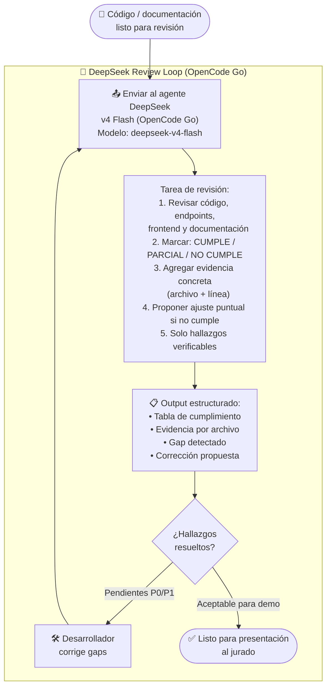
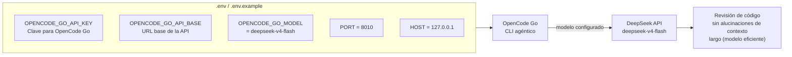
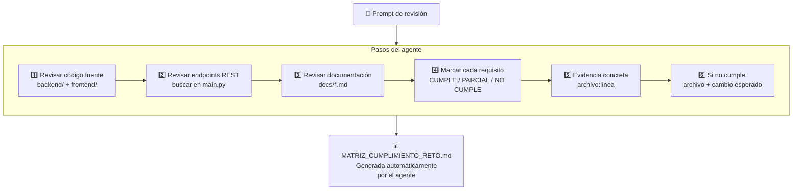

# Diagrama — DeepSeek Review Loop

> Fuente: [`docs/DEEPSEEK_REVIEW_LOOP.md`](../DEEPSEEK_REVIEW_LOOP.md)

## Ciclo de revisión agéntica con DeepSeek

## Configuración del agente (variables de entorno)

## Protocolo de revisión estructurada

