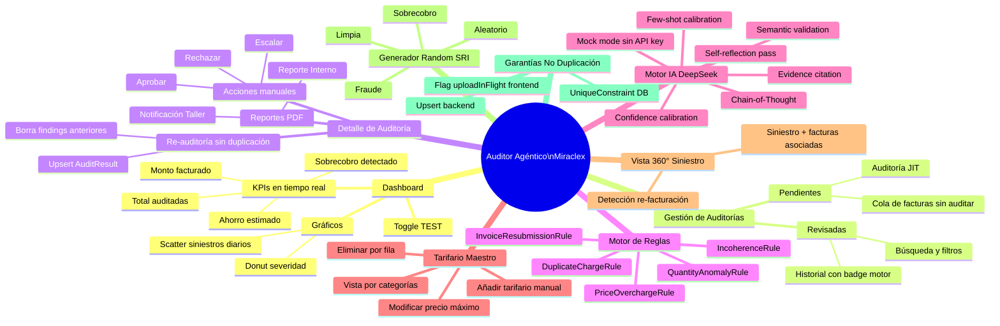
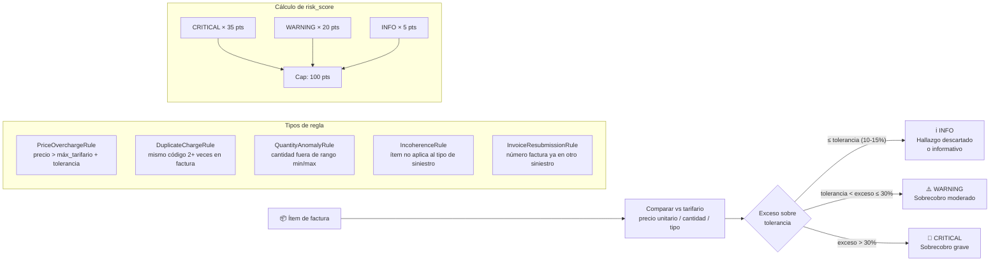
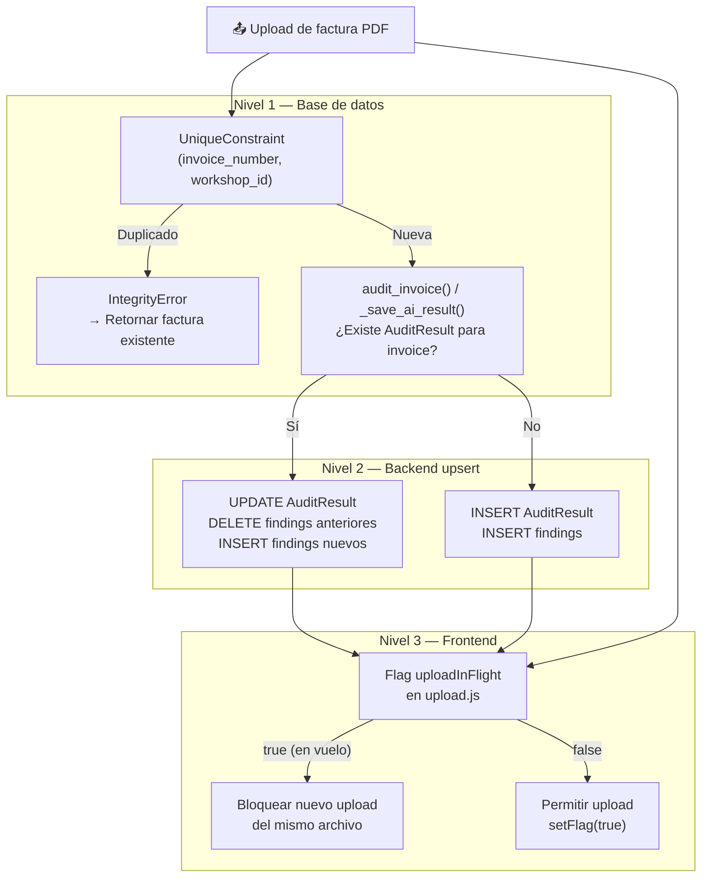

# Diagrama — Funciones del Sistema (DOC_FUNCIONES)

> Fuente: [`docs/DOC_FUNCIONES.md`](../DOC_FUNCIONES.md)

## Mapa de funciones principales

## Calibración del Motor de Reglas

## Garantías de no-duplicación (3 niveles)

