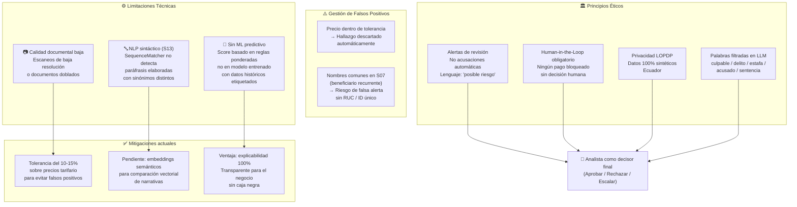
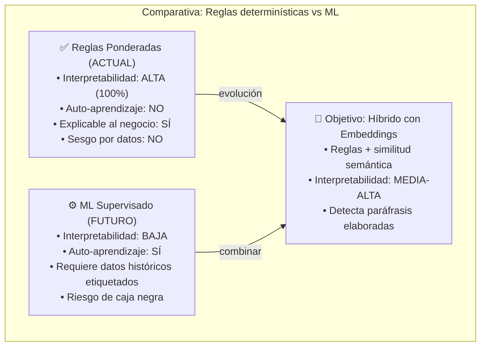
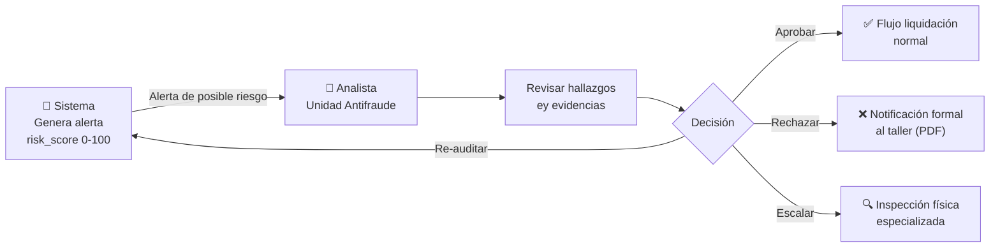

# Diagrama — Limitaciones y Consideraciones Éticas

> Fuente: [`docs/limitaciones.md`](../limitaciones.md)

## Mapa de limitaciones y mitigaciones

## Comparativa: Reglas vs ML

## Ciclo de revisión humana (Human-in-the-Loop)

