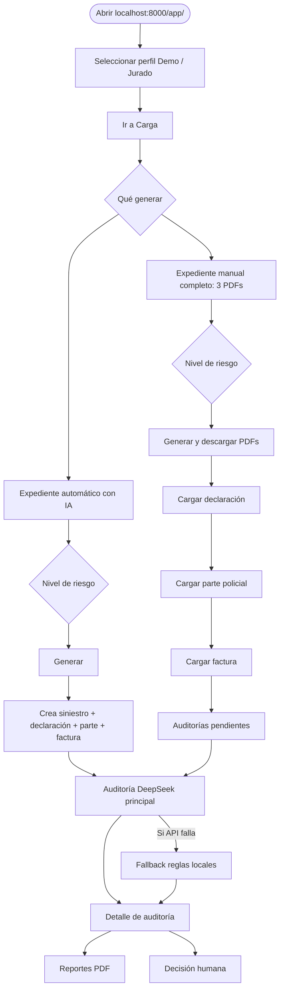
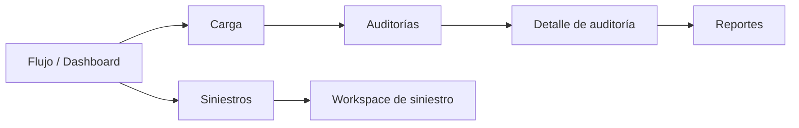
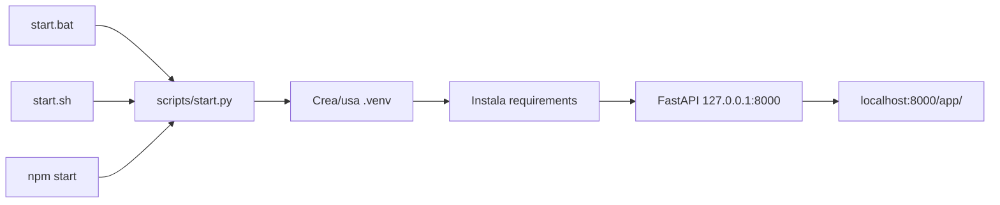

# Diagrama — Manual de Uso

> Fuente: [`docs/MANUAL_USO.md`](../MANUAL_USO.md)

## Flujo recomendado para la demo

```mermaid
flowchart TD
    START([Abrir localhost:8000/app/]) --> PROFILE[Seleccionar perfil Demo / Jurado]
    PROFILE --> UPLOAD[Ir a Carga]

    UPLOAD --> MODE{Qué generar}
    MODE --> AUTO[Expediente automático con IA]
    MODE --> MANUAL[Expediente manual completo: 3 PDFs]

    AUTO --> RISK_AUTO{Nivel de riesgo}
    RISK_AUTO --> AUTO_RUN[Generar]
    AUTO_RUN --> AUTO_CASE[Crea siniestro + declaración + parte + factura]
    AUTO_CASE --> DEEPSEEK[Auditoría DeepSeek principal]
    DEEPSEEK --> DETAIL[Detalle de auditoría]

    MANUAL --> RISK_MANUAL{Nivel de riesgo}
    RISK_MANUAL --> DOCS[Generar y descargar PDFs]
    DOCS --> DECL[Cargar declaración]
    DECL --> POLICE[Cargar parte policial]
    POLICE --> INVOICE[Cargar factura]
    INVOICE --> PENDING[Auditorías pendientes]
    PENDING --> DEEPSEEK

    DEEPSEEK -->|Si API falla| RULES[Fallback reglas locales]
    RULES --> DETAIL
    DETAIL --> REPORTS[Reportes PDF]
    DETAIL --> DECISION[Decisión humana]
```

## Navegación SPA

```mermaid
graph LR
    DASH[Flujo / Dashboard] --> UP[Carga]
    UP --> AUD[Auditorías]
    AUD --> DET[Detalle de auditoría]
    DASH --> SIN[Siniestros]
    SIN --> WS[Workspace de siniestro]
    DET --> REPORT[Reportes]
```

## Arranque

```mermaid
flowchart LR
    W[start.bat] --> LAUNCH[scripts/start.py]
    L[start.sh] --> LAUNCH
    N[npm start] --> LAUNCH
    LAUNCH --> VENV[Crea/usa .venv]
    VENV --> DEPS[Instala requirements]
    DEPS --> API[FastAPI 127.0.0.1:8000]
    API --> APP[localhost:8000/app/]
```
