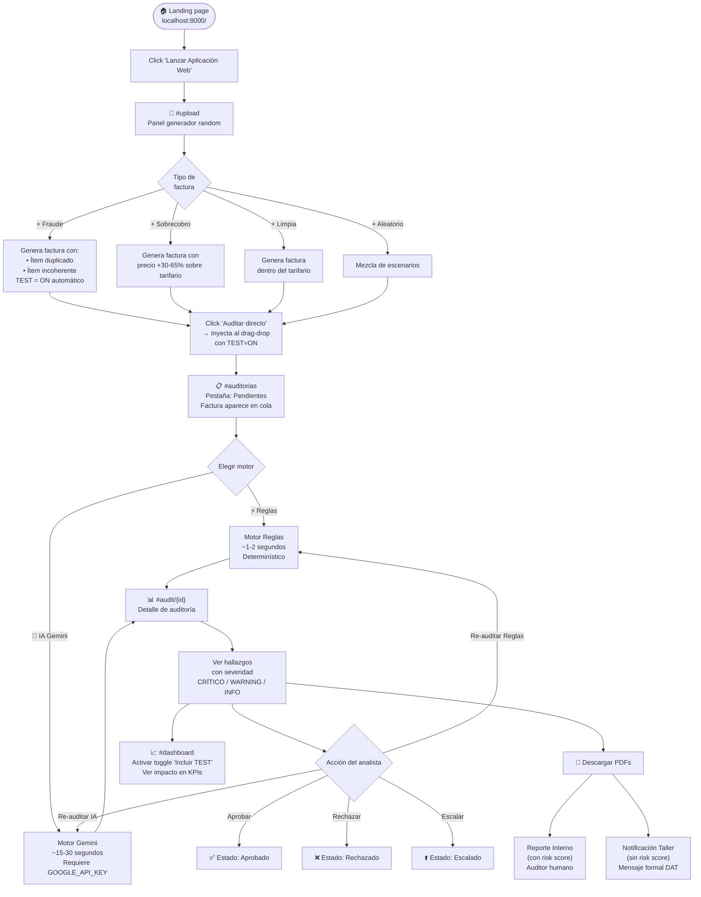
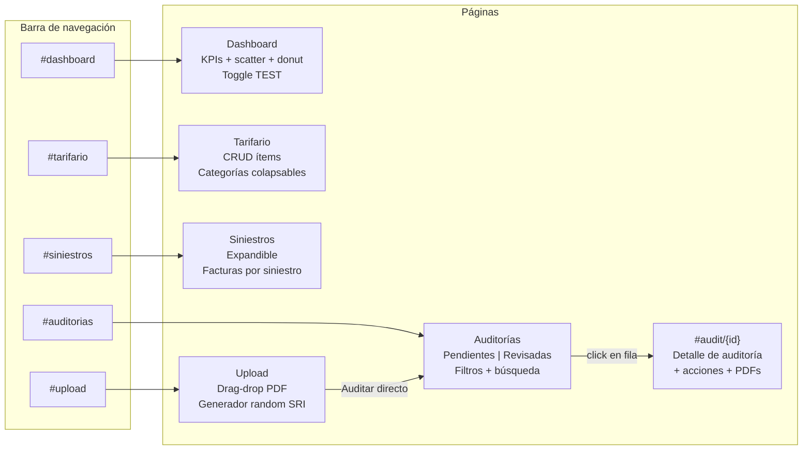
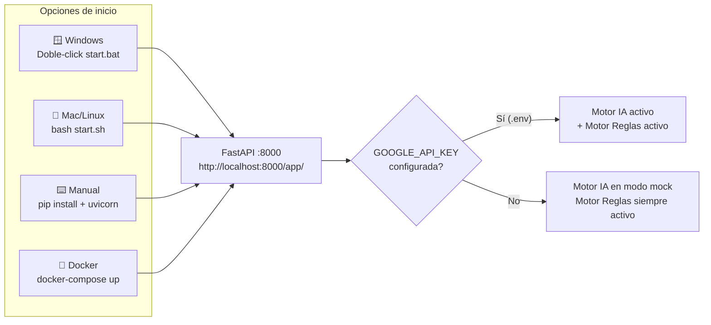

# Diagrama — Manual de Uso

> Fuente: [`docs/MANUAL_USO.md`](../MANUAL_USO.md)

## Flujo de usuario recomendado para la demo

```mermaid
flowchart TD
    START([🏠 Landing page\nlocalhost:8000/]) --> LAUNCH["Click 'Lanzar Aplicación Web'"]
    LAUNCH --> UPLOAD["📁 #upload\nPanel generador random"]

    UPLOAD --> GEN_TYPE{Tipo de\nfactura}
    GEN_TYPE -->|"+ Fraude"| GEN_FRAUD["Genera factura con:\n• Ítem duplicado\n• Ítem incoherente\nTEST = ON automático"]
    GEN_TYPE -->|"+ Sobrecobro"| GEN_OVER["Genera factura con\nprecio +30-65% sobre tarifario"]
    GEN_TYPE -->|"+ Limpia"| GEN_CLEAN["Genera factura\ndentro del tarifario"]
    GEN_TYPE -->|"+ Aleatorio"| GEN_RAND["Mezcla de escenarios"]

    GEN_FRAUD --> AUDIT_DIRECT["Click 'Auditar directo'\n→ Inyecta al drag-drop\ncon TEST=ON"]
    GEN_OVER --> AUDIT_DIRECT
    GEN_CLEAN --> AUDIT_DIRECT
    GEN_RAND --> AUDIT_DIRECT

    AUDIT_DIRECT --> PENDING["📋 #auditorias\nPestaña: Pendientes\nFactura aparece en cola"]
    PENDING --> CHOOSE_ENGINE{Elegir motor}
    CHOOSE_ENGINE -->|"⚡ Reglas"| RULES_ENGINE["Motor Reglas\n~1-2 segundos\nDeterminístico"]
    CHOOSE_ENGINE -->|"🤖 IA Gemini"| AI_ENGINE["Motor Gemini\n~15-30 segundos\nRequiere GOOGLE_API_KEY"]

    RULES_ENGINE --> RESULT["📊 #audit/{id}\nDetalle de auditoría"]
    AI_ENGINE --> RESULT

    RESULT --> VIEW_FINDINGS["Ver hallazgos\ncon severidad\nCRÍTICO / WARNING / INFO"]
    VIEW_FINDINGS --> ACTIONS{Acción del analista}
    ACTIONS -->|"Re-auditar IA"| AI_ENGINE
    ACTIONS -->|"Re-auditar Reglas"| RULES_ENGINE
    ACTIONS -->|"Aprobar"| APPROVED["✅ Estado: Aprobado"]
    ACTIONS -->|"Rechazar"| REJECTED["❌ Estado: Rechazado"]
    ACTIONS -->|"Escalar"| ESCALATED["⬆️ Estado: Escalado"]

    VIEW_FINDINGS --> PDFS["📄 Descargar PDFs"]
    PDFS --> INTERNAL["Reporte Interno\n(con risk score)\nAuditor humano"]
    PDFS --> WORKSHOP["Notificación Taller\n(sin risk score)\nMensaje formal DAT"]

    VIEW_FINDINGS --> DASHBOARD["📈 #dashboard\nActivar toggle 'Incluir TEST'\nVer impacto en KPIs"]
```

## Estructura de navegación SPA

```mermaid
graph LR
    subgraph NAV["Barra de navegación"]
        N1["#dashboard"]
        N2["#auditorias"]
        N3["#tarifario"]
        N4["#siniestros"]
        N5["#upload"]
    end

    subgraph PAGES["Páginas"]
        P1["Dashboard\nKPIs + scatter + donut\nToggle TEST"]
        P2["Auditorías\nPendientes | Revisadas\nFiltros + búsqueda"]
        P3["Tarifario\nCRUD ítems\nCategorías colapsables"]
        P4["Siniestros\nExpandible\nFacturas por siniestro"]
        P5["Upload\nDrag-drop PDF\nGenerador random SRI"]
        P6["#audit/{id}\nDetalle de auditoría\n+ acciones + PDFs"]
    end

    N1 --> P1
    N2 --> P2
    N3 --> P3
    N4 --> P4
    N5 --> P5
    P2 -->|"click en fila"| P6
    P5 -->|"Auditar directo"| P2
```

## Modos de inicio del sistema

```mermaid
flowchart LR
    subgraph START_OPTIONS["Opciones de inicio"]
        A["🪟 Windows\nDoble-click start.bat"]
        B["🐧 Mac/Linux\nbash start.sh"]
        C["⌨️ Manual\npip install + uvicorn"]
        D["🐳 Docker\ndocker-compose up"]
    end

    A & B & C & D --> SERVER["FastAPI :8000\nhttp://localhost:8000/app/"]

    SERVER --> APIKEY{GOOGLE_API_KEY\nconfigurada?}
    APIKEY -->|"Sí (.env)"| FULL["Motor IA activo\n+ Motor Reglas activo"]
    APIKEY -->|"No"| MOCK["Motor IA en modo mock\nMotor Reglas siempre activo"]
```
