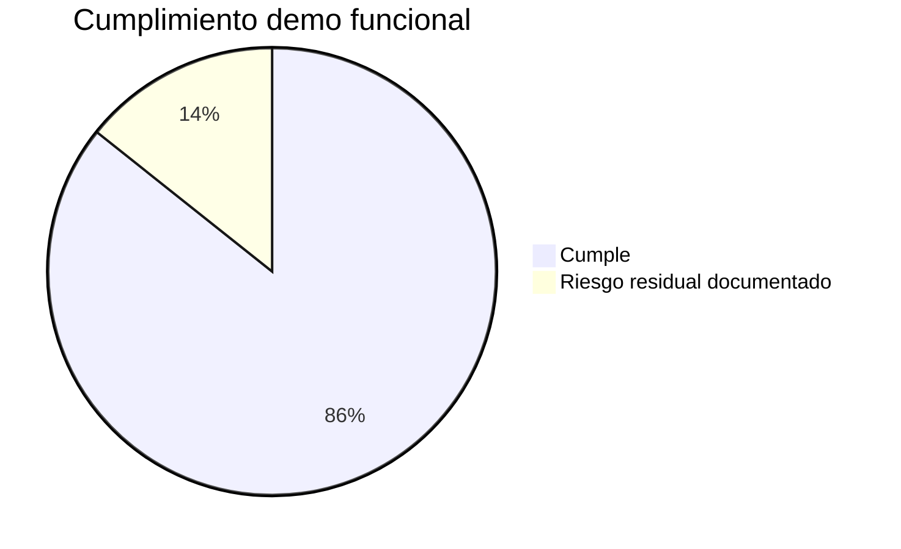
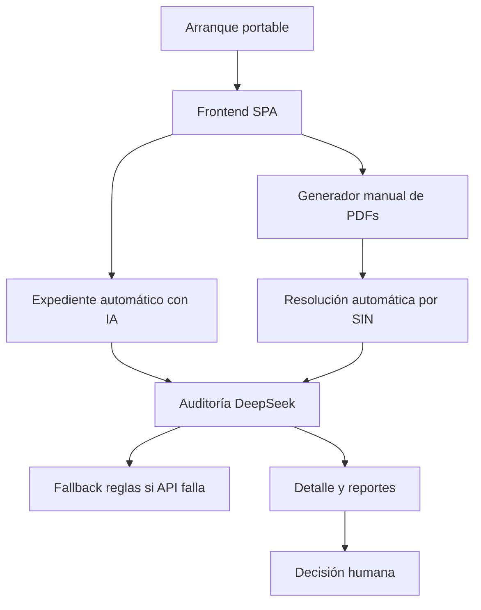
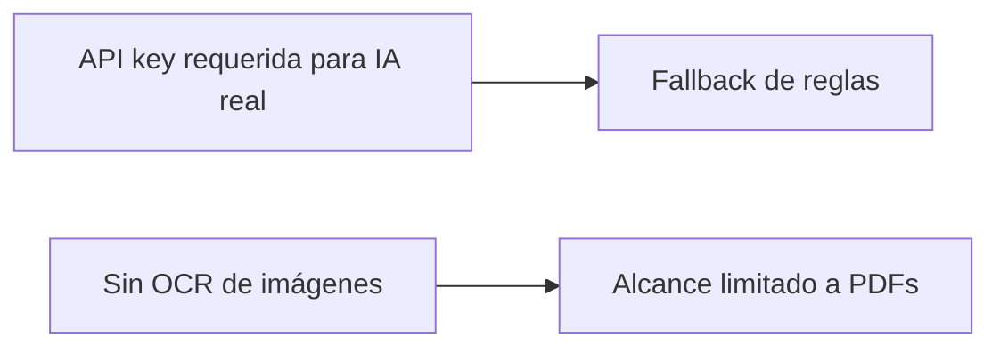

# Diagrama — Matriz de Cumplimiento

> Fuente: [`docs/MATRIZ_CUMPLIMIENTO_RETO.md`](../MATRIZ_CUMPLIMIENTO_RETO.md)

## Estado final por categoría

## Capacidades verificables

## Riesgos residuales

