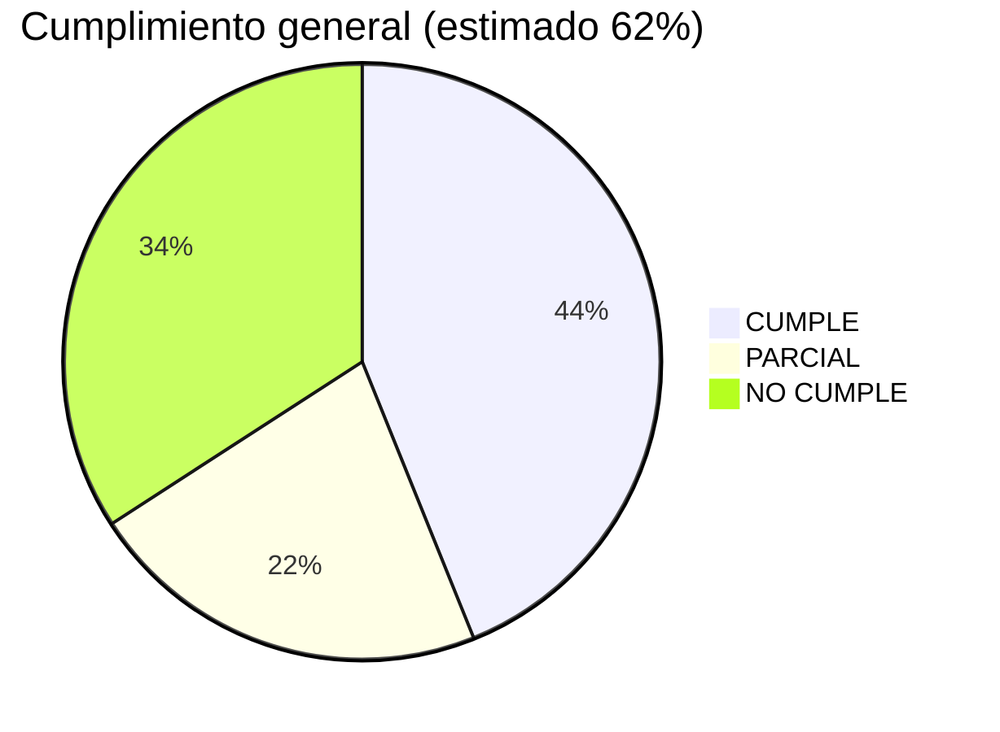
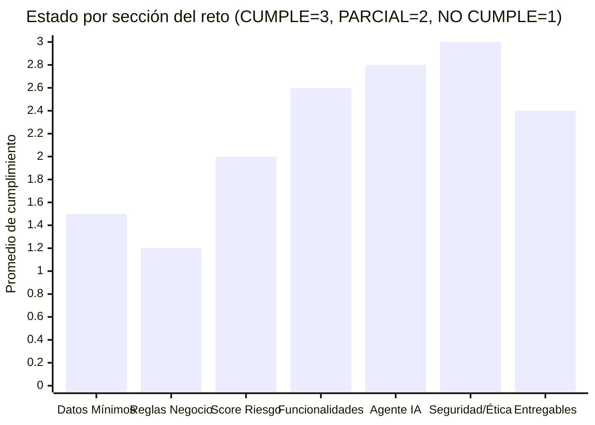
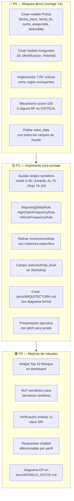
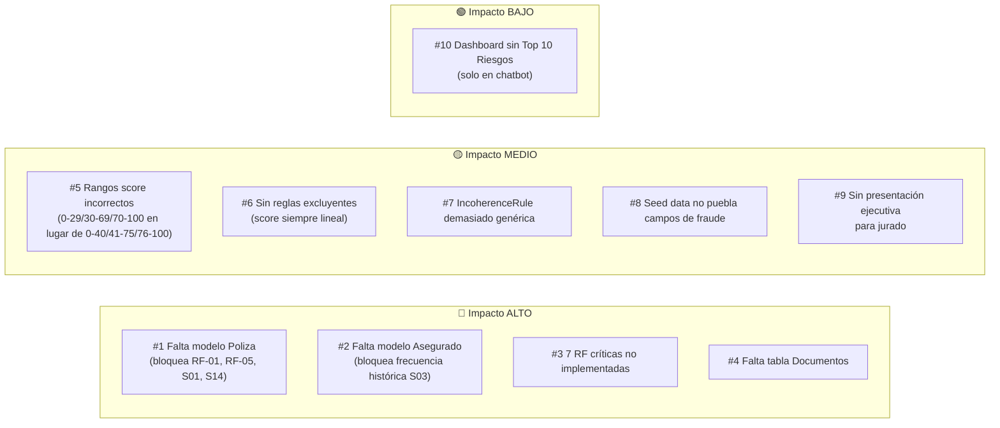

# Diagrama — Matriz de Cumplimiento del Reto

> Fuente: [`docs/MATRIZ_CUMPLIMIENTO_RETO.md`](../MATRIZ_CUMPLIMIENTO_RETO.md)

## Estado de cumplimiento por categoría

## Heatmap de cumplimiento por sección

## Prioridades de corrección (P0 → P2)

## Top 10 hallazgos críticos

