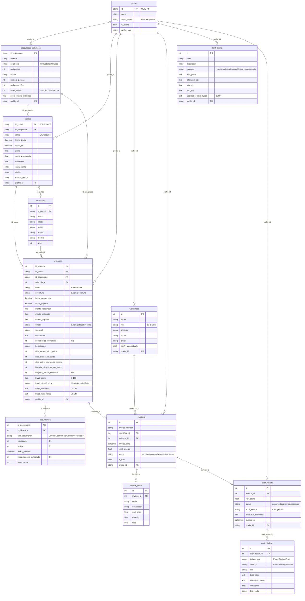
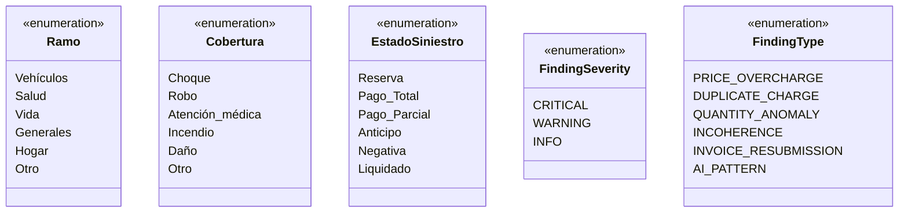

# Diagrama — Modelo de Datos

> Fuente: [`docs/modelo_datos.md`](../modelo_datos.md)

## Diagrama Entidad-Relación (ERD)

```mermaid
erDiagram
    profiles {
        string id PK "UUID v4"
        string name
        string token_secret "nunca expuesto"
        bool is_active
        string profile_type
    }

    asegurados_sinteticos {
        string id_asegurado PK
        string nombre
        string segmento "VIP/Estándar/Básico"
        int antiguedad
        string ciudad
        int numero_polizas
        int reclamos_12m
        int mora_actual "0=Al día / 1=En mora"
        float score_cliente_simulado
        string profile_id FK
    }

    polizas {
        string id_poliza PK "POL-XXXXX"
        string id_asegurado FK
        string ramo "Enum Ramo"
        datetime fecha_inicio
        datetime fecha_fin
        float prima
        float suma_asegurada
        float deducible
        string canal_venta
        string ciudad
        string estado_poliza
        string profile_id FK
    }

    vehiculos {
        int id PK
        string id_poliza FK
        string placa
        string chasis
        string motor
        string marca
        string modelo
        int anio
    }

    siniestros {
        int id_siniestro PK
        string id_poliza FK
        string id_asegurado FK
        int vehiculo_id FK
        string ramo "Enum Ramo"
        string cobertura "Enum Cobertura"
        datetime fecha_ocurrencia
        datetime fecha_reporte
        float monto_reclamado
        float monto_estimado
        float monto_pagado
        string estado "Enum EstadoSiniestro"
        string sucursal
        text descripcion
        int documentos_completos "0/1"
        string beneficiario
        int dias_desde_inicio_poliza
        int dias_desde_fin_poliza
        int dias_entre_ocurrencia_reporte
        int historial_siniestros_asegurado
        int etiqueta_fraude_simulada "0/1"
        float fraud_score "0-100"
        string fraud_classification "Verde/Amarillo/Rojo"
        text fraud_indicators "JSON"
        text fraud_rules_failed "JSON"
        string profile_id FK
    }

    documentos {
        int id_documento PK
        int id_siniestro FK
        string tipo_documento "Cédula/Licencia/Denuncia/Presupuesto"
        int entregado "0/1"
        int legible "0/1"
        datetime fecha_emision
        int inconsistencia_detectada "0/1"
        text observacion
    }

    workshops {
        int id PK
        string name
        string ruc "13 dígitos"
        string address
        string phone
        string email
        bool notify_automatically
        string profile_id FK
    }

    invoices {
        int id PK
        string invoice_number
        int workshop_id FK
        int siniestro_id FK
        datetime invoice_date
        float total_amount
        string status "pending/approved/rejected/escalated"
        bool is_test
        string profile_id FK
    }

    invoice_items {
        int id PK
        int invoice_id FK
        string code
        string description
        float unit_price
        float quantity
        float total
    }

    tariff_items {
        int id PK
        string code
        string description
        string category "repuesto/pintura/material/mano_obra/servicio"
        float max_price
        float tolerance_pct
        float min_qty
        float max_qty
        text applicable_claim_types "JSON"
        string profile_id FK
    }

    audit_results {
        int id PK
        int invoice_id FK
        float risk_score
        string status "approved/completed/escalated"
        string audit_engine "rules/gemini"
        text executive_summary
        datetime audited_at
        string profile_id FK
    }

    audit_findings {
        int id PK
        int audit_result_id FK
        string finding_type "Enum FindingType"
        string severity "Enum FindingSeverity"
        string title
        text description
        text recommendation
        float confidence
        string item_code
    }

    profiles ||--o{ asegurados_sinteticos : "profile_id"
    profiles ||--o{ polizas : "profile_id"
    profiles ||--o{ siniestros : "profile_id"
    profiles ||--o{ workshops : "profile_id"
    profiles ||--o{ invoices : "profile_id"
    profiles ||--o{ tariff_items : "profile_id"
    profiles ||--o{ audit_results : "profile_id"

    asegurados_sinteticos ||--o{ polizas : "id_asegurado"
    asegurados_sinteticos ||--o{ siniestros : "id_asegurado"
    polizas ||--o{ siniestros : "id_poliza"
    polizas ||--o| vehiculos : "id_poliza"
    vehiculos ||--o{ siniestros : "vehiculo_id"
    siniestros ||--o{ documentos : "id_siniestro"
    siniestros ||--o{ invoices : "siniestro_id"
    workshops ||--o{ invoices : "workshop_id"
    invoices ||--o{ invoice_items : "invoice_id"
    invoices ||--o| audit_results : "invoice_id"
    audit_results ||--o{ audit_findings : "audit_result_id"
```

## Enumeraciones

```mermaid
classDiagram
    class Ramo {
        <<enumeration>>
        Vehículos
        Salud
        Vida
        Generales
        Hogar
        Otro
    }

    class Cobertura {
        <<enumeration>>
        Choque
        Robo
        Atención_médica
        Incendio
        Daño
        Otro
    }

    class EstadoSiniestro {
        <<enumeration>>
        Reserva
        Pago_Total
        Pago_Parcial
        Anticipo
        Negativa
        Liquidado
    }

    class FindingSeverity {
        <<enumeration>>
        CRITICAL
        WARNING
        INFO
    }

    class FindingType {
        <<enumeration>>
        PRICE_OVERCHARGE
        DUPLICATE_CHARGE
        QUANTITY_ANOMALY
        INCOHERENCE
        INVOICE_RESUBMISSION
        AI_PATTERN
    }
```
