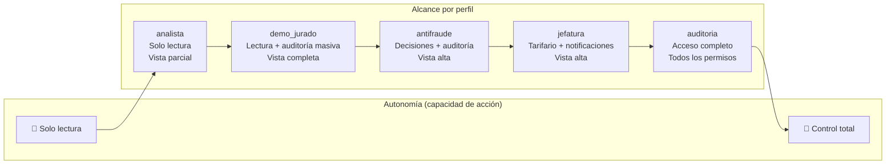
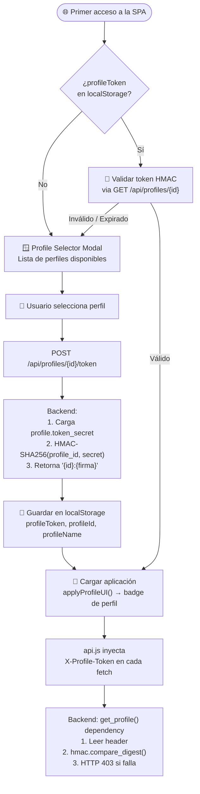
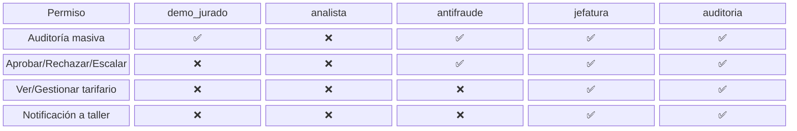
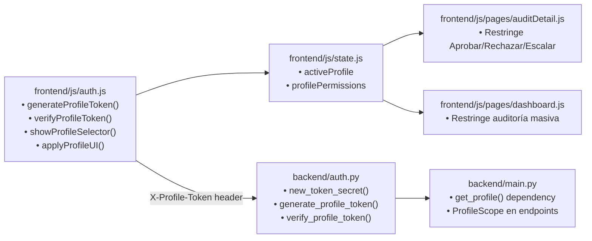

# Diagrama — Perfiles de Acceso

> Fuente: [`docs/PERFILES_ACCESO.md`](../PERFILES_ACCESO.md)

## Matriz de permisos por perfil

## Flujo de selección de perfil y autenticación

## Permisos detallados por perfil

## Archivos de implementación

