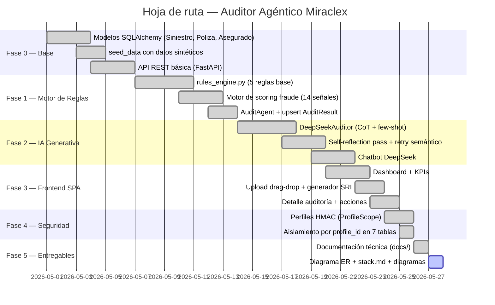
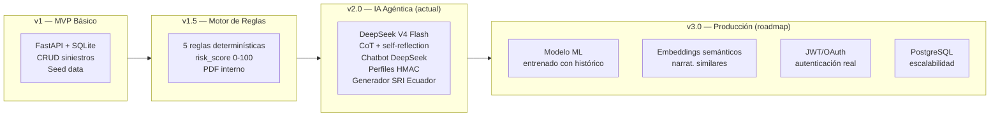
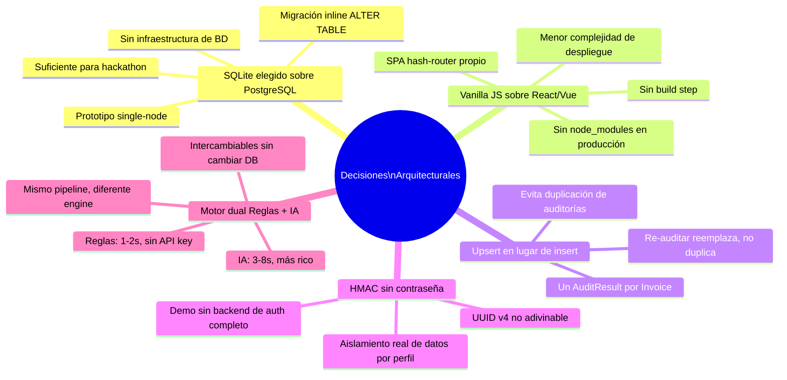

# Diagrama — Plan Sofisticado de Implementación

> Fuente: [`docs/PLAN_SOFISTICADO_IMPLEMENTACION.md`](../PLAN_SOFISTICADO_IMPLEMENTACION.md)

## Hoja de ruta de implementación

## Arquitectura por fases de madurez

## Decisiones de arquitectura clave

