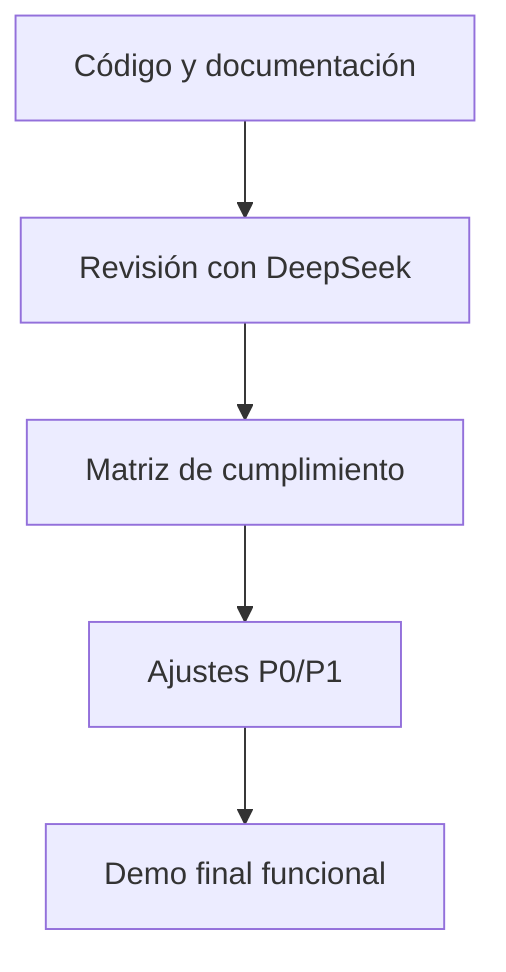
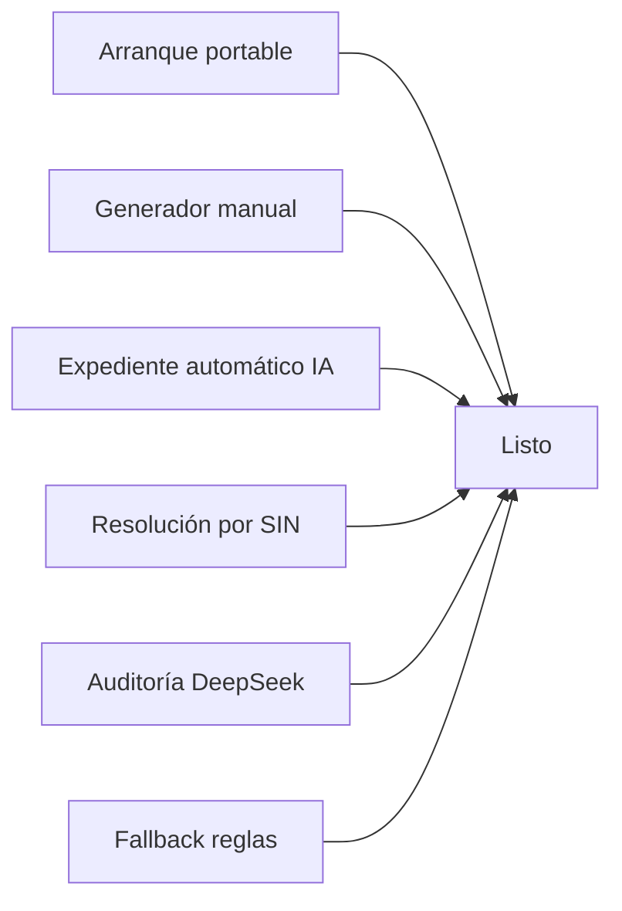

# Diagrama — Revisión DeepSeek

> Fuente: [`docs/PROMPT_DEEPSEEK_P0_FINAL.md`](../PROMPT_DEEPSEEK_P0_FINAL.md)

## Uso de DeepSeek en revisión del proyecto

```mermaid
flowchart TD
    A[Código y documentación] --> B[Revisión con DeepSeek]
    B --> C[Matriz de cumplimiento]
    C --> D[Ajustes P0/P1]
    D --> E[Demo final funcional]
```

## Estado final de capacidades

```mermaid
flowchart LR
    S1[Arranque portable] --> OK[Listo]
    S2[Generador manual] --> OK
    S3[Expediente automático IA] --> OK
    S4[Resolución por SIN] --> OK
    S5[Auditoría DeepSeek] --> OK
    S6[Fallback reglas] --> OK
```
