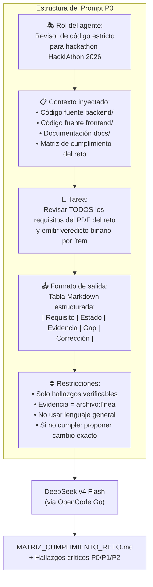
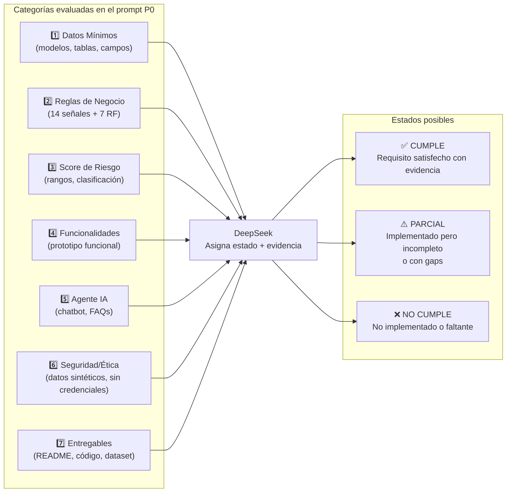
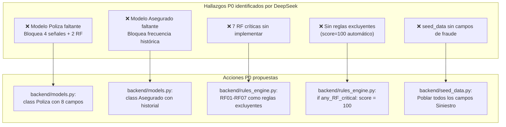

# Diagrama — Prompt DeepSeek P0 Final

> Fuente: [`docs/PROMPT_DEEPSEEK_P0_FINAL.md`](../PROMPT_DEEPSEEK_P0_FINAL.md)

## Estructura del prompt de revisión P0

## Clasificación de requisitos evaluados

## Priorización P0 resultante del prompt

