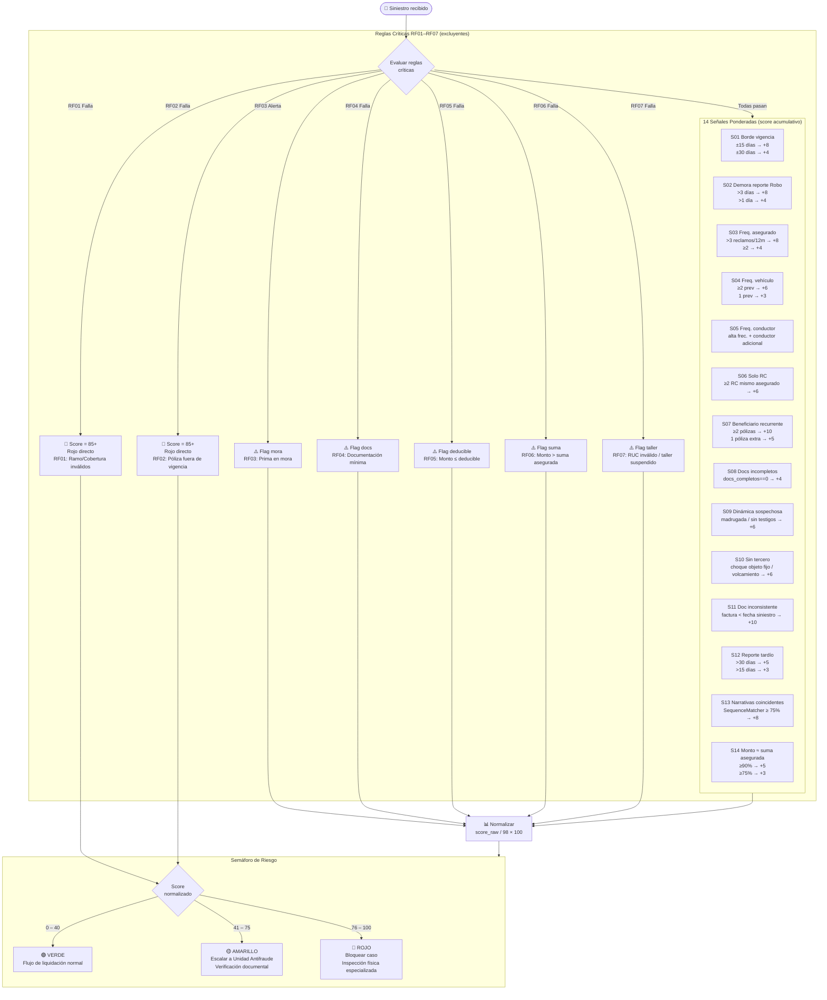
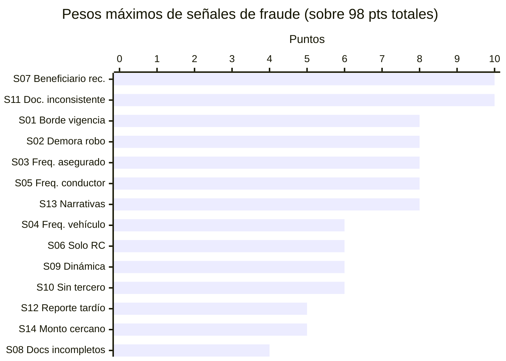
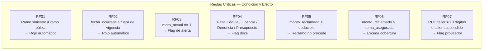

# Diagrama — Reglas de Negocio y Scoring Antifraude

> Fuente: [`docs/reglas_negocio.md`](../reglas_negocio.md)

## Pipeline de evaluación de fraude

## Detalle de señales (pesos máximos)

## Reglas críticas (RF) — tabla de decisión

