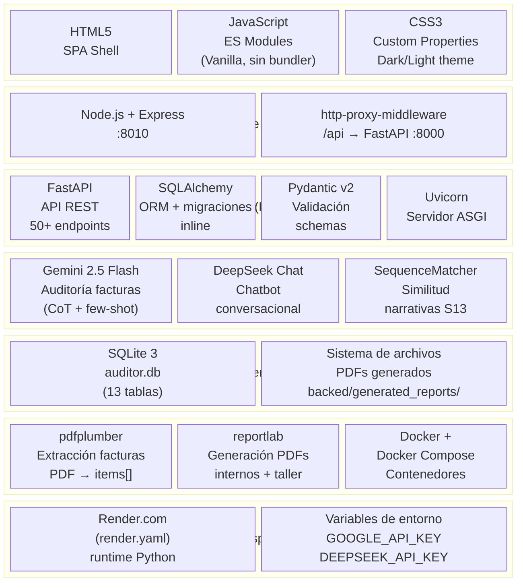
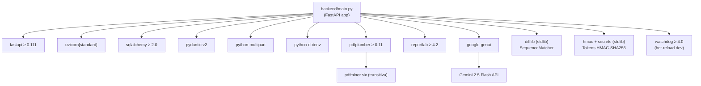
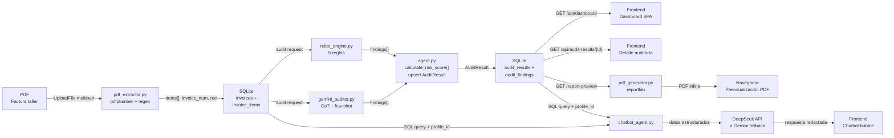

# Diagrama — Stack Tecnológico

> Fuente: [`docs/stack.md`](../stack.md)

## Stack completo en capas

```mermaid
block-beta
    columns 1

    block:FRONTEND["🖥️ Frontend (Cliente)"]
        columns 3
        A1["HTML5\nSPA Shell"] A2["JavaScript\nES Modules\n(Vanilla, sin bundler)"] A3["CSS3\nCustom Properties\nDark/Light theme"]
    end

    block:PROXY["🔀 Proxy de Desarrollo"]
        columns 2
        B1["Node.js + Express\n:8010"] B2["http-proxy-middleware\n/api → FastAPI :8000"]
    end

    block:BACKEND["⚙️ Backend (Python 3.11)"]
        columns 4
        C1["FastAPI\nAPI REST\n50+ endpoints"] C2["SQLAlchemy\nORM + migraciones\ninline"] C3["Pydantic v2\nValidación\nschemas"] C4["Uvicorn\nServidor ASGI"]
    end

    block:IA["🤖 Capa de IA"]
        columns 3
        D1["Gemini 2.5 Flash\nAuditoría facturas\n(CoT + few-shot)"] D2["DeepSeek Chat\nChatbot\nconversacional"] D3["SequenceMatcher\nSimilitud\nnarrativas S13"]
    end

    block:STORAGE["🗄️ Almacenamiento"]
        columns 2
        E1["SQLite 3\nauditor.db\n(13 tablas)"] E2["Sistema de archivos\nPDFs generados\nbacked/generated_reports/"]
    end

    block:TOOLS["📦 Herramientas"]
        columns 3
        F1["pdfplumber\nExtracción facturas\nPDF → items[]"] F2["reportlab\nGeneración PDFs\ninternos + taller"] F3["Docker +\nDocker Compose\nContenedores"]
    end

    block:DEPLOY["☁️ Despliegue"]
        columns 2
        G1["Render.com\n(render.yaml)\nruntime Python"] G2["Variables de entorno\nGOOGLE_API_KEY\nDEEPSEEK_API_KEY"]
    end
```

## Árbol de dependencias Python

```mermaid
graph TD
    APP["backend/main.py\n(FastAPI app)"]

    APP --> FASTAPI["fastapi ≥ 0.111"]
    APP --> UVICORN["uvicorn[standard]"]
    APP --> SQLALCHEMY["sqlalchemy ≥ 2.0"]
    APP --> PYDANTIC["pydantic v2"]
    APP --> MULTIPART["python-multipart"]
    APP --> DOTENV["python-dotenv"]

    APP --> PDFPLUMBER["pdfplumber ≥ 0.11"]
    PDFPLUMBER --> PDFMINER["pdfminer.six (transitiva)"]

    APP --> REPORTLAB["reportlab ≥ 4.2"]
    APP --> GOOGLEAI["google-genai"]
    GOOGLEAI --> GEMINI["Gemini 2.5 Flash API"]

    APP --> DIFFLIB["difflib (stdlib)\nSequenceMatcher"]
    APP --> HMAC["hmac + secrets (stdlib)\nTokens HMAC-SHA256"]
    APP --> WATCHDOG["watchdog ≥ 4.0\n(hot-reload dev)"]
```

## Flujo de datos entre capas

```mermaid
flowchart LR
    PDF["PDF\nFactura taller"] -->|"UploadFile multipart"| EXTRACT["pdf_extractor.py\npdfplumber + regex"]
    EXTRACT -->|"items[], invoice_num, ruc"| DB_INV["SQLite\ninvoices +\ninvoice_items"]

    DB_INV -->|"audit request"| RULES["rules_engine.py\n5 reglas"]
    DB_INV -->|"audit request"| GEMINI_AUD["gemini_auditor.py\nCoT + few-shot"]

    RULES & GEMINI_AUD -->|"findings[]"| AGENT["agent.py\ncalculate_risk_score()\nupsert AuditResult"]
    AGENT -->|"AuditResult"| DB_AUDIT["SQLite\naudit_results +\naudit_findings"]

    DB_AUDIT -->|"GET /api/dashboard"| DASH["Frontend\nDashboard SPA"]
    DB_AUDIT -->|"GET /api/audit-results/{id}"| DETAIL["Frontend\nDetalle auditoría"]
    DB_AUDIT -->|"GET /report-preview"| PDF_GEN["pdf_generator.py\nreportlab"]
    PDF_GEN -->|"PDF inline"| BROWSER["Navegador\nPrevisualización PDF"]

    DB_INV & DB_AUDIT -->|"SQL query + profile_id"| CHATBOT["chatbot_agent.py"]
    CHATBOT -->|"datos estructurados"| DEEPSEEK["DeepSeek API\no Gemini fallback"]
    DEEPSEEK -->|"respuesta redactada"| BOT_UI["Frontend\nChatbot bubble"]
```
