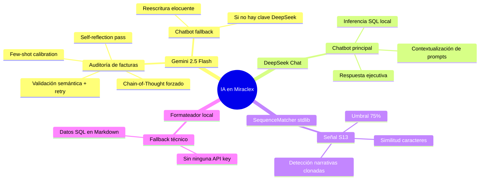
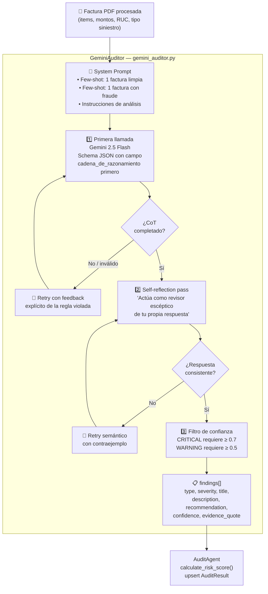
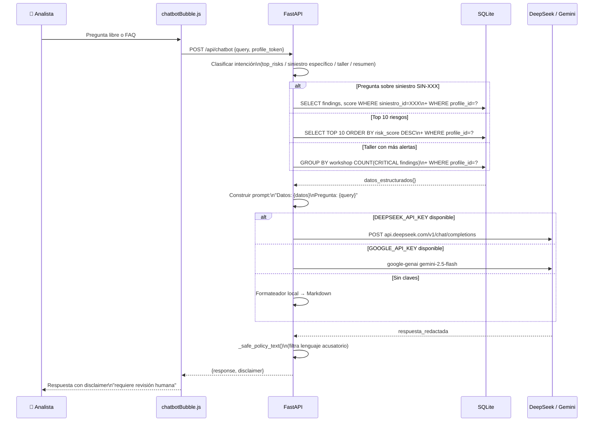
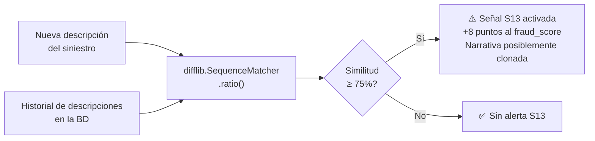

# Diagrama — Uso de Inteligencia Artificial

> Fuente: [`docs/uso_ia.md`](../uso_ia.md)

## Mapa de componentes IA

## Pipeline — Auditoría cognitiva de facturas (Gemini)

## Pipeline — Chatbot conversacional (DeepSeek / Gemini)

## Señal S13 — Similitud de narrativas (SequenceMatcher)

